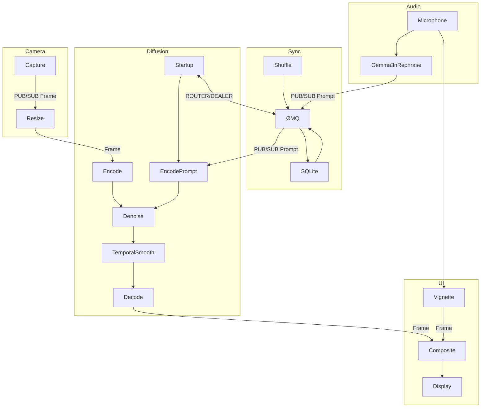

# Mirror Mirror

An art installation that transforms live camera feeds into AI-generated artwork using voice-guided prompts.


## Architecture


```mermaid
graph TD

subgraph Sync
Z[ØMQ] --> SQLite
SQLite --> Z
Shuffle --> Z
end

subgraph Audio
C2[Microphone] --> R[Gemma3nRephrase]
R -- PUB/SUB Prompt --> Z
end

subgraph Camera
C1[Capture]
Resize
end

subgraph Diffusion
Startup <--> |ROUTER/DEALER| Z 
Startup --> EncodePrompt
C1[Capture] --> |PUB/SUB Frame| Resize
Resize --> |Frame| Encode
Z --> |PUB/SUB Prompt| EncodePrompt
Encode --> Denoise
EncodePrompt --> Denoise
Denoise --> TemporalSmooth
TemporalSmooth --> Decode
end

subgraph UI
C2 --> V[Vignette]
Decode --> |Frame| Composite
V --> |Frame| Composite
Composite --> Display
end
```

## Quick Start

```bash
make start
```
